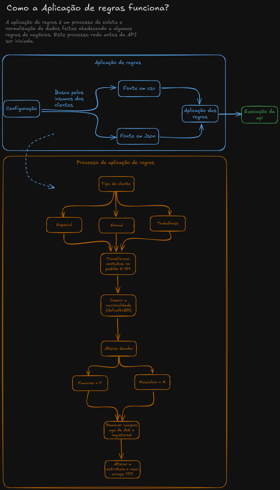
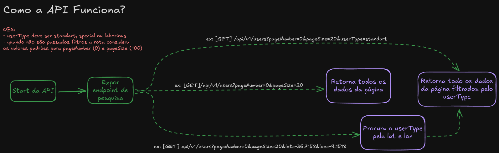
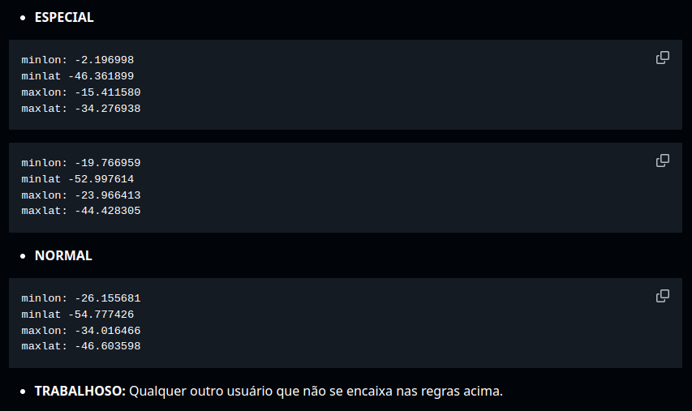
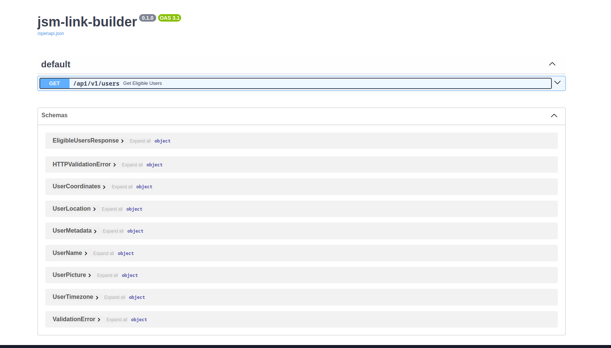
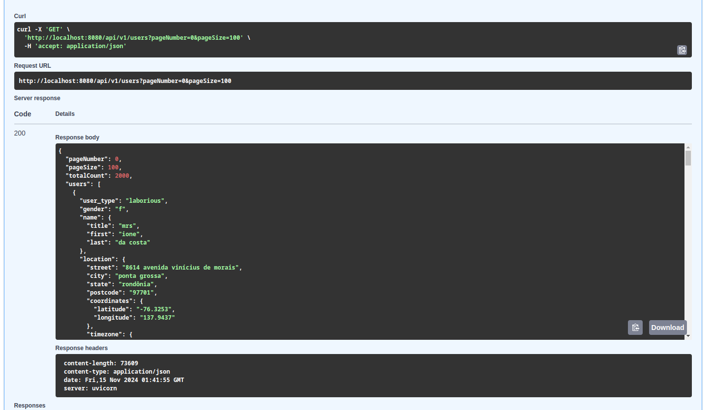
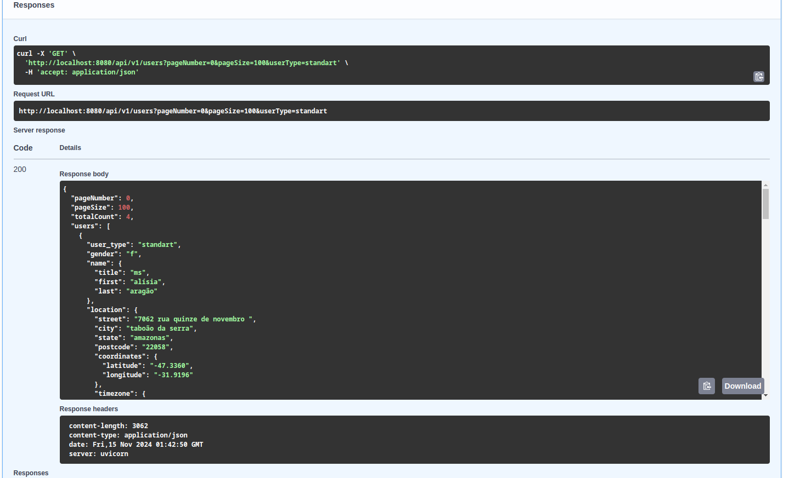
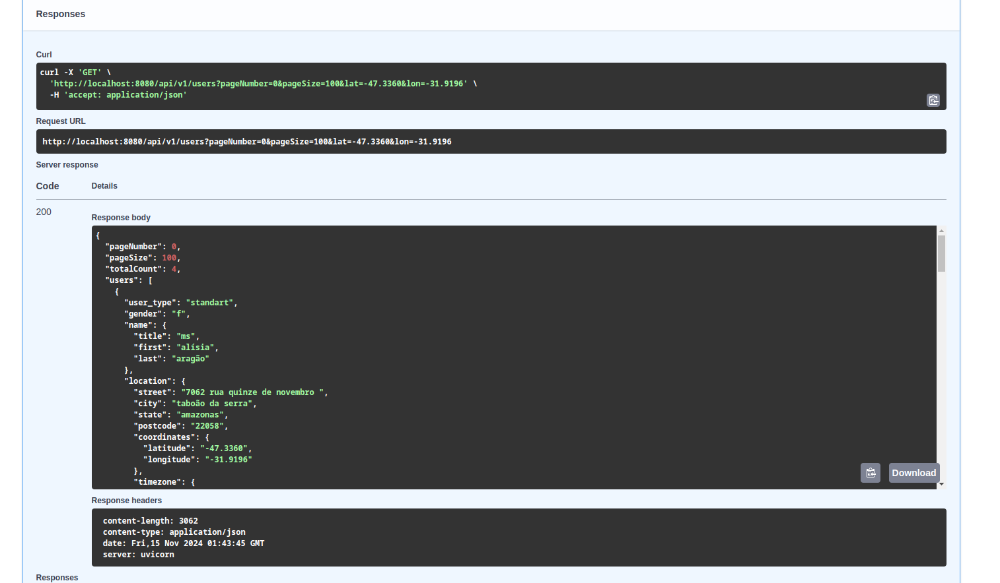
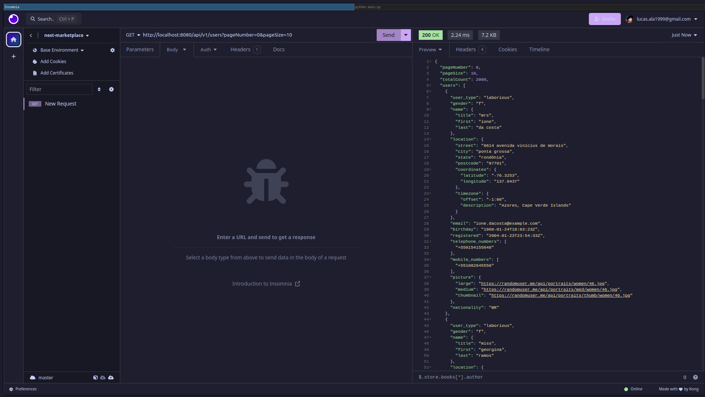
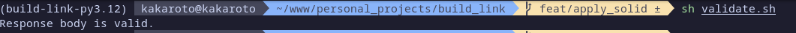

# JSM - Link Builder

```
        _..._
      .'     '.      _
     /    .-""-\   _/ \
   .-|   /:.   |  |   |
   |  \\  |:.   /.-'-./
   | .-'-;:__.'    =/
   .'=  *=|$$$$ _.='
  /   _.  |    ;
 ;-.-'|    \\   |
/   | \\    _\\  _\\
\\__/'._;@1DY==' ==\\
         \\    \\   |
          /   /   /
         /-._/-._/
         \\   `\\
          `-._/._/

 _     ___ _   _ _  __  ____  _   _ ___ _     ____  _____ ____
| |   |_ _| \ | | |/ / | __ )| | | |_ _| |   |  _ \| ____|  _ \
| |    | ||  \| | ' /  |  _ \| | | || || |   | | | |  _| | |_) |
| |___ | || |\  | . \  | |_) | |_| || || |___| |_| | |___|  _ <
|_____|___|_| \_|_|\_\ |____/ \___/|___|_____|____/|_____|_| \_\
```

- Powerd by 🚀: Lucas Amorim
- Email 📧: lucas.ala1999@gmail.com
- GitHub 🐙: lucas.ala1999@gmail.com
- Linkedin 🔗: https://www.linkedin.com/in/lucas-amorim-b09691173/

# Objetivo do projeto

O projeto foi baseado no teste [técnico da empresa Juntos Somos Mais](https://github.com/juntossomosmais/code-challenge?tab=readme-ov-file).

Este projeto consiste em um serviço de disponibilização de dados de cliente elegíveis através de uma API REST que irá disponibilizar um endpoint de busca e filtragens. O sistema irá realizar um processo de ETL de dados para que sejam feitas as aplicações de regras de negócio e irá armazenar estes dados tratados em cache antes do início da API. Os dados são passados para o contexto da api que por fim, disponibiliza um endpoint com algumas opções relacionadas a filtragem e paginação.

# Tecnologias utilizadas

Para este projeto foram utilizadas algumas tecnologias:

- **[Python](https://www.python.org/downloads/release/python-3126/)** (Versão 3.12.6): Linguagem escolhida para o desenvolvimento do projeto.
- **[Poetry](https://python-poetry.org/)** (Versão 1.8.4): Para fazer o gerenciamento do ambiente virtual.
- **[FastApi](https://fastapi.tiangolo.com/)** (Versão 0.115.4).
- **[Docker](https://docs.docker.com/engine/release-notes/27/#2720)** (Versão 27.2.0): Para conseguir gerar um contâiner da aplicação.

# Sobre a .env

Antes de instalar o projeto, seja HardCoded ou com Docker, é extremamente importante setar as variáveis de ambiente. No sistema, deixei um exemplo para a .env, chamado .env.example, antes de instalar e rodar o projeto, crie um arquivo chamado .env com o seguinte conteúdo:

```sh
# Api config enviroments
API_TITLE=nome_da_api # Indica o nome da api
API_PORT=8080 # Indica a porta na qual a aplicação será alocada
API_HOST=0.0.0.0 # Indica o host da aplicação (ex: localhost ou 0.0.0.0)
API_LOG_LEVEL=info # Indica o level de log (info, warning, error...)

# Users data enviroments
USERS_ORIGINS=link_1, link_2 # Lista de links de busca para os dados da api. OBS: Os links devem ser separados por ,
```

Aqui está um exemplo simples e completo de .env:

```sh
# Api config enviroments
API_TITLE=jsm-link-builder
API_PORT=8080
API_HOST=0.0.0.0
API_LOG_LEVEL=info

# Users data enviroments
USERS_ORIGINS=https://storage.googleapis.com/juntossomosmais-code-challenge/input-backend.csv, https://storage.googleapis.com/juntossomosmais-code-challenge/input-backend.json
```

com a .env na pasta root do projeto, agora podemos seguir para a instalação:

# Instalação do projeto (HardCoded)

Para realizar a instalação do projeto e poder rodá-lo, basta seguir os requisitos de tecnologias utilizadas e seguir o passo à passo:

1 - acesse a pasta raíz do projeto e rode o poetry para ativar o ambiente virtual:

```sh
poetry shell
```

2 - instale todas as dependências com o poetry:

```sh
poetry install
```

3 - com todos os pacotes instalados e a .env configurada, agora basta rodar o projeto com:

```sh
python main.py
```

Feito isso o sistema irá rodar o processo para fazer a aplicação de regras e salvar os dados em cache e a aplicação irá funcionar conforme os dados colocados na .env (ex: http://localhost:8080/).

# Instalação do projeto com Docker

Para facilitar a vida de quem quiser testar este projeto, disponibilizei ele com docker.

**Com o docker instalado**. Para iniciar o projeto é muito simples, basta rodar:

```sh
docker compose up --build -d
```

esperar a api rodar... e por fim, basta acessar a api montando os endpoints **com os dados enviados na .env**

# Processo de aplicação de regras



O processo de aplicação de regras inicia antes da disponibilização da api e faz a extração dos dados das urls setadas no arquivo de configuração `.env`. Para facilitar esta parte, optei por utilizar uma estrutura de classes respeitando o SOLID para que fosse possível que esse processo ficasse fácil de ler, ser feita manutenção e também alguma adição de lógica no futuro.

O processo é feito pela classe UsersETL (em src/libs/load_data/users_etl.py) que é responsável por fazer a requisição para os endpoints e, dependendo do tipo de arquivo (por hora: JSON e CSV) enviar para as classes de Extração (`UserDataExtractorJSON` e `UserDataExtractorCSV` que herdam de `UserDataExtractorInterface`) e transformação (`UserDataTransformJSON` e `UserDataTransformCSV` que herdam de `UserDataTransformInterface`). As classes de transformação citadas anteriormente irão se comunicar com a lib `business_rules` (em src/libs/business_rules) que irão disponibilizar as classes responsáveis pela aplicação das regras de negócio em ambos os casos (sendo elas: `BusinessRulesCSV` e `BusinessRulesJSON` que herdam de `BusinessRulesInterface`). Essas classes irão implementar os objetos que irão ser passados para o contexto da api e serão utilizados como retorno das rotas de busca. Ao final teremos uma lista de objetos `UserMetadata` para trabalhar no sistema (por curiosidade, iniciei desenvolvendo com dataclass esse objeto mas pude perceber que o pydantic lida melhor com o fastapi, portanto segui herdando todos os objetos schemas do meu projeto de `BasModel`).

Agora que conhecemos melhor a estrutura da coleta de dados do projeto, vamos falar especificamente quais dados são tratados:

1. Os dados de contatos telefônicos são convertiudos para o formato E.164. Exemplo: (86) 8370-9831 vira +558683709831.
2. A nacionalidade é inserida, caso esse retorno não venha dos objetos alvo, ela seta a nacionalidade como BR por padrão.
3. O valor do campo gender é alterado para F ou M em vez de female ou male.
4. Os campos dob e registered são removidos, porém, como pude observar na descrição do teste o exemplo do output, substitui dob.date por brithday e registered.date por registered para seguir o modelo exemplo do teste.
5. Altera a estrutura para simplificar leitura e usar arrays em campos específicos.

# Endpoints disponibnilizados pela API



A api disponibiliza dois endpoints:

- `/docs`: contém a documentação do projeto.
  - Exemplo de utilização: http://localhost:8080/docs
- `/api/v1/users`: responsável pela listagem dos usuários elegíveis.
  - Exemplo de utilização: http://localhost:8080/api/v1/users
  - Exemplo de utilização com filtros de paginação: http://localhost:8080/api/v1/users?pageNumber=0&pageSize=10
  - Exemplo de utilização com filtro de tipo de usuário:
  - Exemplo de retorno:
    ```json
    {
      "pageNumber": 0,
      "pageSize": 1,
      "totalCount": 2000,
      "users": [
        {
          "user_type": "laborious",
          "gender": "f",
          "name": {
            "title": "mrs",
            "first": "ione",
            "last": "da costa"
          },
          "location": {
            "street": "8614 avenida vinícius de morais",
            "city": "ponta grossa",
            "state": "rondônia",
            "postcode": "11111",
            "coordinates": {
              "latitude": "-76.3253",
              "longitude": "137.9437"
            },
            "timezone": {
              "offset": "-1:00",
              "description": "Azores, Cape Verde Islands"
            }
          },
          "email": "ione.dacosta@example.com",
          "birthday": "1968-01-24T18:03:23Z",
          "registered": "2004-01-23T23:54:33Z",
          "telephone_numbers": ["+550154155638"],
          "mobile_numbers": ["+551082625550"],
          "picture": {
            "large": "https://randomuser.me/api/portraits/women/46.jpg",
            "medium": "https://randomuser.me/api/portraits/med/women/46.jpg",
            "thumbnail": "https://randomuser.me/api/portraits/thumb/women/46.jpg"
          },
          "nationality": "BR"
        }
      ]
    }
    ```

# FIltros

Para este teste criei os seguintes filtros (Query Params) para a rota de users:

- **pageNumber** e **pageSize**: filtros relacionados a paginação, onde pageNumber representa o número do objeto que dará início a página da página (ex: pageNumber=10 significa que a filtragem irá começar à partir do décimo item). Vale ressaltar que, caso não seja enviado nenhum parâmetro relacionado a paginação, o endpoint irá retornar a paginação padrão (`pageNumber=0` e `pageSize=100`);
- **userType**: este parâmetro filtra a busca por registros com um determinado tipo de usuário, sendo eles:
  - **standart**: tipos de usuário **Normal**;
  - **special**: tipos de usuário **Especial**;
  - **laborious**: tipo de usuário **Trabalhoso**;
- **lat** e **lon**: representam a **latitude** (**lat**) e a **longitude** (**lon**) para que seja possível o filtro de busca para clientes que ainda não sabem seu tipo, porém tem disponível a localização. Vale ressaltar que **ambos os campos devem ser passados** juntos e com números no formato de **ponto flutuante (float, ex: -33.666)**, caso os campos não sejam enviados juntos a api irá retornar um status 400 (bad request) e irá recomendar o uso dos dois campos.

# Documentação

O projeto conta, além desta documentação, com uma documentação web via Swagger, sendo acessada no link [http://{base_url}/docs](http://{base_url}/docs) (lembrando que base_url se refere ao host e port inseridos na .env do projeto, ex: [http://localhost:8080/docs](http://localhost:8080/docs)). Além do Swagger ainda tem outra forma de documentação implementada para este projeto, que são as docstrings inseridas em cada classe e método desde projeto, elas tem como objetivo auxiliar a novos desenvolvedores do projeto além de fornecer na maior parte dos editores um resumo sobre a classe ou a função em questão.

# OBS

Durante o desenvolvimento pude detectar um pequeno equivoco na documentação do teste técnico, mais especificamente na parte de classificação do tipo de usuário, onde no teste tinhamos os seguintes intervalos de latitude e longitude para classificar:
<br><br>

<br><br>
Observe que, por exemplo, no tipo especial temos a minLon como `~= -2` e a maxLon como `~= -15`, por se trtar de números negativos, o `-15` deveria ser o menor número, já que ele está mais distante do zero no eixo em questão.

Eu percebi isso, pois durante o desenvolvimento, notei que após fazer a transformação do tipo de usuário, todos estavam retornando como do tipo `laborious` (trabalhoso), então achei muito estranho (pois são 2000 dados então a probablidade de todos serem do tipo trabalhoso eram minimas). Então eu notei que pareciam estar invertidos os valores maximos e minimos das latitudes e longitudes, então inverti eles e começaram a aparecer tipos `standart` (Normais) e `special` (Especiais)

# Evidências

Aqui deixarem alguns prints e evidências da aplicação funcionando:

- Documentação Swagger:
  

- Teste simples feito com swagger:
  

- Teste de filtro com userType no swagger:
  

- Teste de filtro com lat e lon feito no swagger:
  

- Teste simples feito com insomnia:
  

- Teste simples feito com CRUL:
  
